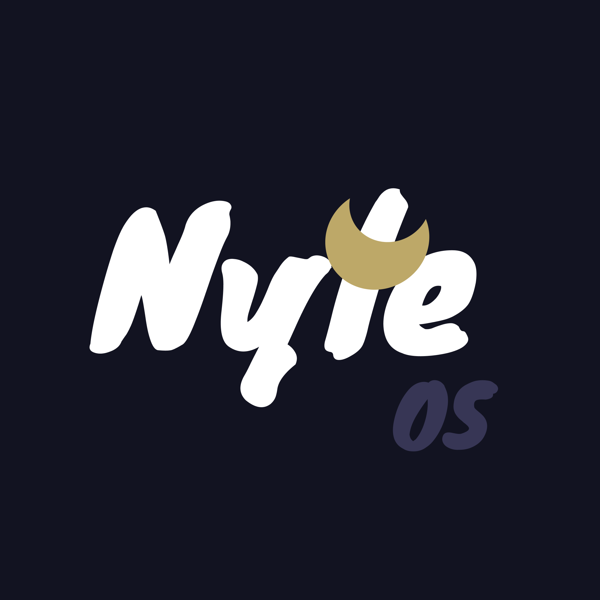
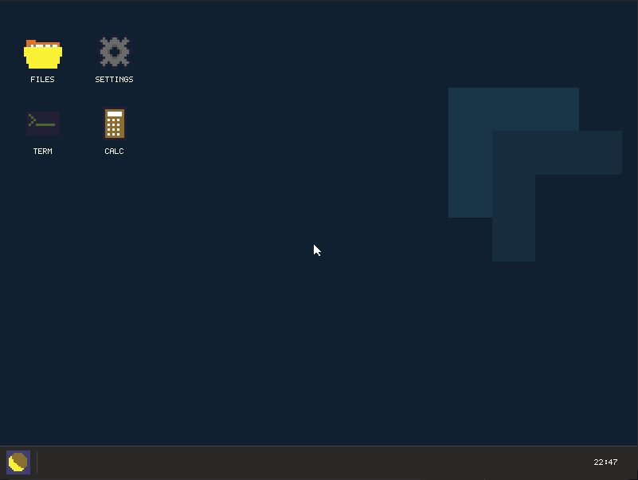
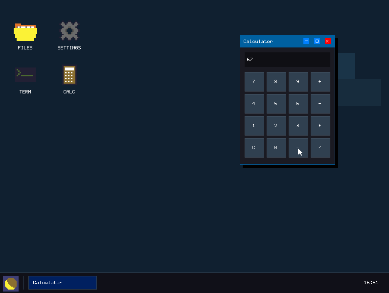

# NyteOS
A lightweight Operating System made from scratch using Assembly and C. (beta/experimental)



## Screenshots




## Hardware Requirements

### Minimum
- CPU: Pentium 4 2.8 GHz
- RAM: 5 MB DDR
- GPU: Intel GMA 950
- Storage: 600 KB

### Recommended
- CPU: Intel Core 2 Duo E8400 or better
- RAM: 16 MB DDR2 or more/better
- GPU: Intel GMA X4500 or better
- Storage: 2 MB or more

### Architecture
- x86 (32-bit)

## Installation
### Linux
```bash
curl -fsSL https://raw.githubusercontent.com/batata123muitoboa-dot/NyteOS/main/install.sh | bash
```

### Windows (cmd)
```cmd
curl -fsSL https://raw.githubusercontent.com/batata123muitoboa-dot/NyteOS/main/install.bat | cmd
```

### Windows (powershell)
```powershell
curl.exe -fsSL https://raw.githubusercontent.com/batata123muitoboa-dot/NyteOS/main/install.bat | cmd
```
